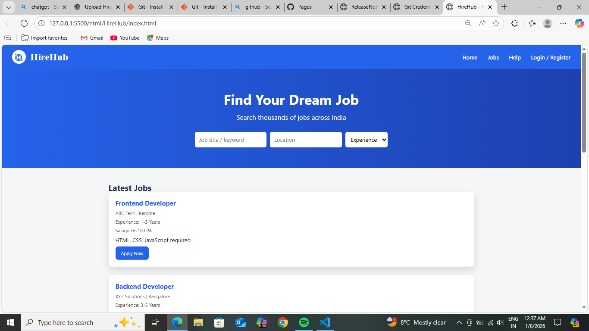
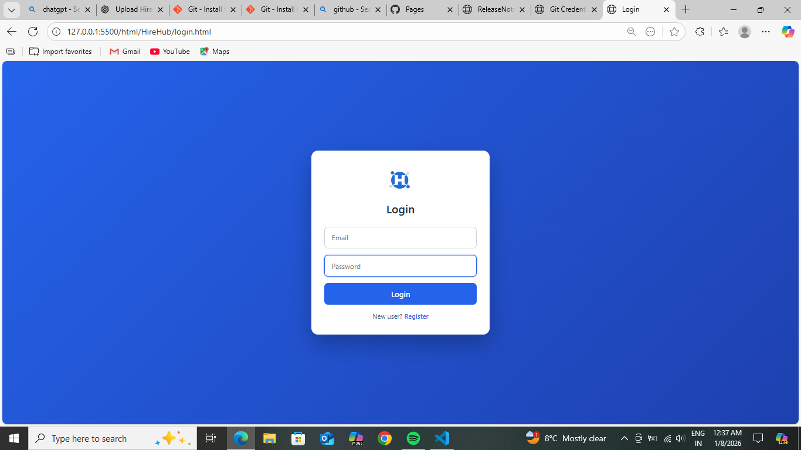
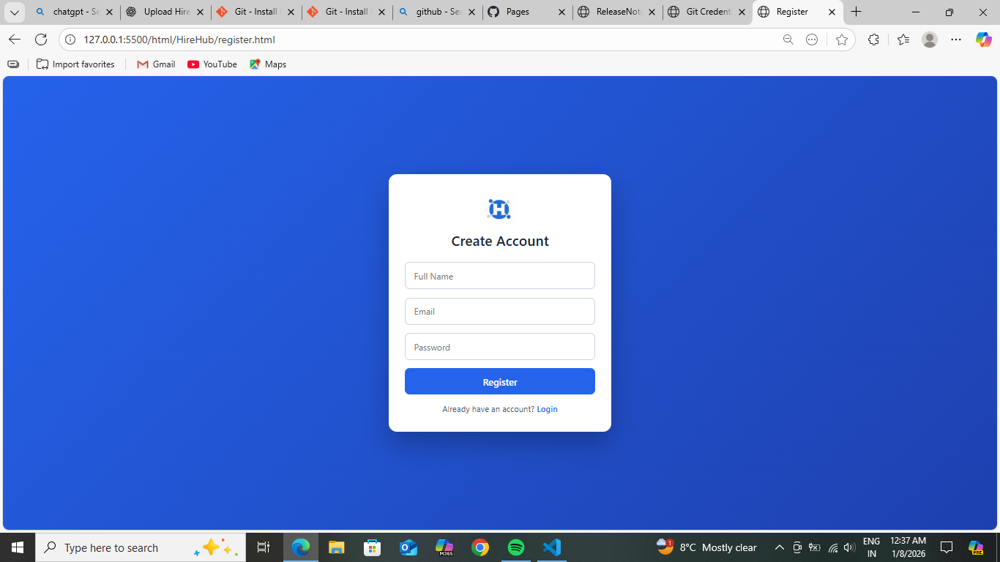
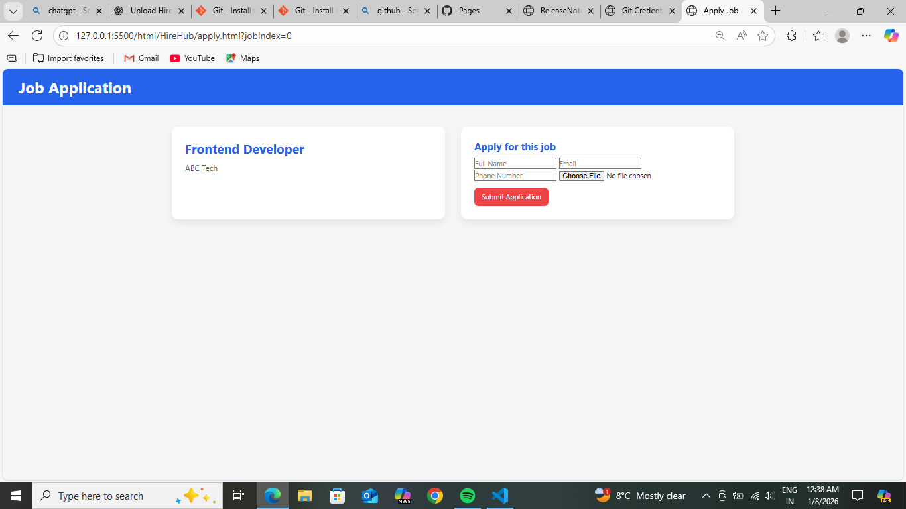
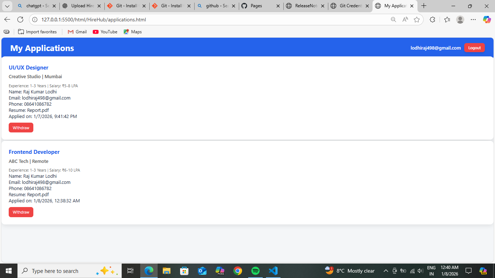

# HireHub – Job Portal Web Application

HireHub is a front-end job portal web application that allows users to register, log in, browse available jobs, and apply for them.  
The project is designed to simulate a real-world hiring platform and demonstrate practical web development skills.

---

## 🚀 Features

- User Registration and Login system
- Job listings display
- Apply for jobs functionality
- Application tracking
- Clean and responsive UI
- Client-side data handling using JavaScript

---

## 🛠️ Technologies Used

- **HTML5** – Structure and layout  
- **CSS3** – Styling and responsive design  
- **JavaScript (ES6)** – Application logic and interactivity  

---

## 📂 Project Structure

HireHub/
│
├── index.html
├── apply.html
├── login.html
├── register.html
│
├── style.css
├── login.css
│
├── script.js
├── auth.js
├── apply.js
├── applications.js
│
├── hirehub.png
├── README.md
└── screenshots/
    ├── home.png
    ├── login.png
    ├── register.png
    ├── applyForJob.png
    └── applications.png

---

## ▶️ How to Run the Project

1. Clone the repository:
   ```bash
   git clone https://github.com/Rajkumar-raj1/HireHub.git
   ```
2. Open the project folder.

3. Open index.html in any modern web browser.

No backend or database is required for running this project.

## 🎯 Purpose & Learning Outcomes

This project was developed to strengthen practical knowledge of front-end web development and understand how real-world web applications are structured.

Through this project, I gained experience in:

- Structuring multi-page web applications
- Handling user authentication logic on the client side
- Managing application data using JavaScript
- Designing clean and user-friendly interfaces
- Working with Git and GitHub for version control

## 🌐 Live Demo

**Live Website:** [HireHub Live](https://rajkumar-raj1.github.io/HireHub/)  
*(Hosted using GitHub Pages)*


## 🧪 Sample Test Credentials

Use the following sample credentials to test the application:

Email: test@example.com

Password: 123456

(You can also register a new account)

## 📸 Screenshots






## 🧑‍💻 Author

Raj Lodhi

GitHub: https://github.com/Rajkumar-raj1

Project: HireHub – Job Portal Web Application

## 📜 License

This project is open-source and created for educational and learning purposes.